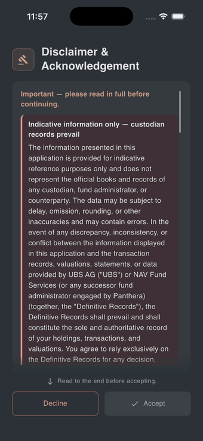

# Disclaimer & Acknowledgement

The first time you sign in — and again any time the legal text is updated to a new version — the app shows a full-screen **Disclaimer & Acknowledgement** before letting you into the reports. This page explains what it is and how to get past it.

## Why this screen exists

Panthera Insight is a regulated, read-only reporting app. The disclaimer is the place where you confirm that you understand:

- **Records from UBS and NAV prevail** in case of any discrepancy — the app's content is indicative only.
- The app is **not a trading or advisory tool**.
- Access is **granted only to invited clients** and you are responsible for the device you use it on.

The full text is shown in-app and is also linked from the [legal & privacy site](https://panthera-sg.github.io/panthera-insight-legal/).

## How to accept

1. Read the disclaimer. The screen shows the text in a scrollable area with a fade hint at the bottom.
2. Scroll all the way to the end. Once you reach the bottom, a green check and the line **"You have reviewed the disclaimer."** appear, and the **Accept** button becomes active.
3. Tap **Accept**.

The app then proceeds to your reports (or, on first sign-in, to the **"Stay signed in on this device?"** prompt described in [Signing in](signing-in.md#keep-me-signed-in)).

{ width="260" }

??? tip "If the Accept button is greyed out"
    You have not yet scrolled to the end. The screen shows **"Read to the end before accepting."** with a small down-arrow. Keep scrolling — the button activates automatically once the bottom comes into view.

??? warning "If you tap Decline"
    The app switches to a lock screen with a single button: **Accept and continue**. There is no other way forward — accepting the disclaimer is a condition of using the app. You can tap **Review disclaimer again** to scroll back through the text before deciding. The Android back button is disabled on this screen.

??? tip "Why am I seeing this again?"
    The disclaimer is re-shown whenever the legal text is updated to a new version, so that your acceptance is recorded against the current wording. This is rare. Just scroll to the end and tap **Accept** again.

## Where to read it later

The same text is permanently available outside the app at the [legal & privacy site](https://panthera-sg.github.io/panthera-insight-legal/). Links to the [Privacy Notice](https://panthera-sg.github.io/panthera-insight-legal/privacy.html) and [Terms of Service](https://panthera-sg.github.io/panthera-insight-legal/terms.html) also live in **Settings → Legal**.
