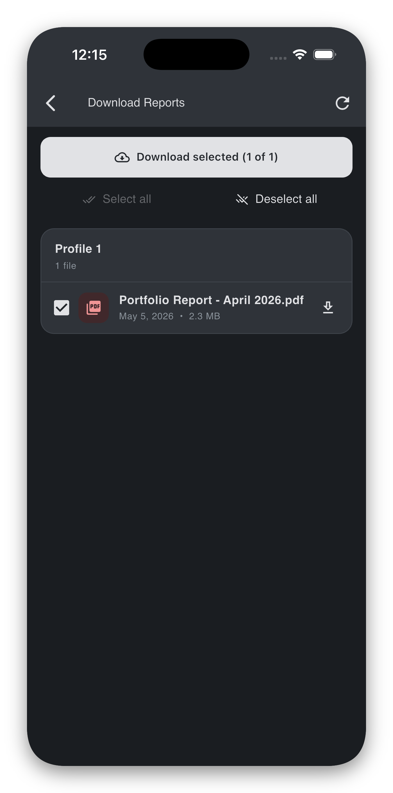
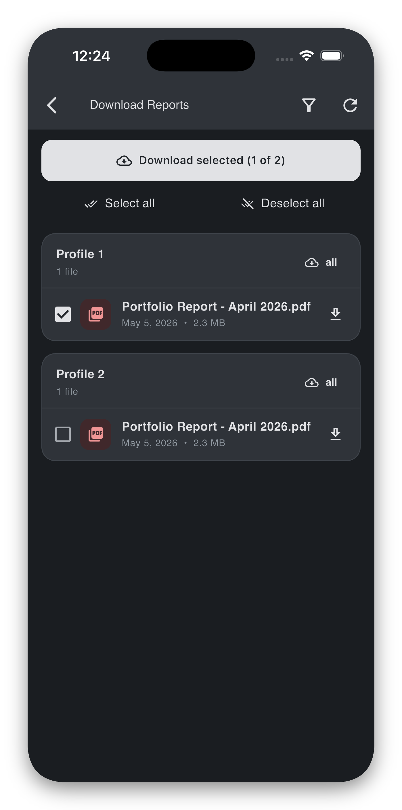

# Downloading reports

The **Download Reports** screen is the archive of every PDF report available to your account, grouped by profile (client account). Use it to preview a single report in-app, save individual PDFs to your device, or download many at once.

Open it from the **Download** icon at the top of the report home.

!!! info "Clarification - Available Reports"
    Note that for each account, there will usually only be **one latest PDF report** available for download, documenting the **most recent state** of the account **at the time the report is generated and uploaded.**
    
    ***Any changes that occur between the report’s shipping time and the user’s viewing time may not be recorded or reflected in it.***

## What you see

- A card per **profile** you have access to. Each card shows the profile name and a file count (e.g. *"1 file"*).
- Inside each card, one row per available PDF, with the title, uploaded date, and file size (e.g. *"May 5, 2026 • 2.3 MB"*).
- A **checkbox** next to each row, plus **Select all** / **Deselect all** buttons per card.
- A **Download selected (N of M)** button pinned at the top.
- A **Filter** icon (top-right of the screen) for narrowing the visible profiles.

{width="260" }

## Previewing a single PDF

Tap any PDF row on the PDF name (not its checkbox) to open it in the in-app preview. The preview supports:

- Scrolling and zooming through pages.
- A **Download** icon (top-right of the preview) to save the file to your device or share it.

??? tip "If the preview fails to load"
    The screen shows **"Failed to load PDF: …"**. Check your internet connection and tap back, then try again. If the same file keeps failing, use the **Download** action from the list to save it locally and open it in your device's PDF app.

## Downloading one or more reports

1. Tick the checkbox next to each report you want. The top button updates to **Download selected (N of M)**.
2. Tap **Download selected**.
3. While the download runs, the button shows **Downloading N/M…** and individual rows show a spinner.
4. When everything is done, a snackbar confirms: **"Downloaded *N* files"**.

Files are saved to:

- **iPhone / iPad:** the app's **Documents** directory, accessible via the iOS *Files* app under "On My iPhone / iPad → Panthera Insight". iCloud backup is intentionally off for these files.
- **Android:** the device **Downloads** folder.

{width="260" }

??? tip "If some files fail"
    The snackbar reports **"Downloaded *N* of *M* (*K* failed)"** when one or more files could not be saved. Per-file errors also appear as a snackbar (**"Download failed: …"**). The successful files are saved; you can re-select only the failed ones and retry.

??? tip "Bulk select within a card"
    Use **Select all** / **Deselect all** at the top of a profile card to flip every checkbox in that card. These buttons disable themselves when there is nothing left to act on.

## Filtering by profile

If you have access to many clients, use the **Filter** icon (top-right) to narrow the list:

1. Tap **Filter profiles**.
2. In the dialog, untick the profiles you want to hide. The dialog also has **Select all** / **Deselect all** buttons.
3. Tap **Apply**.

The filter icon turns the brand accent colour while a filter is active, with a tooltip such as *"Profiles filtered (3)"*. Tap the icon again to adjust or clear the filter.

??? tip "If you deselect everything"
    The dialog blocks the **Apply** button and shows **"Pick at least one profile."** — at least one profile must remain selected so the screen has something to show.

??? tip "If you see "No profiles match the current filter.""
    Your current filter leaves the visible list empty. Open the filter dialog and re-include at least one profile.

## Important notes about saved PDFs

!!! warning "Saved PDFs are a point-in-time copy"
    A saved PDF is a copy of the report **at the moment you saved it**. If Panthera later corrects a report, the saved copy on your device will **not** update. The version inside the app is always the current authoritative copy.

!!! info "Privacy and backup"
    Saved PDFs are excluded from iCloud / device cloud backup by the app. They are stored only on the device they were saved to. Deleting the app removes them.

## Edge cases

??? tip "If the list fails to load — "Failed to load reports.""
    Check your internet connection and tap **Retry**. If the error persists, sign out and back in. If it still persists, email [it@pantherafo.com](mailto:it@pantherafo.com).

??? tip "If you see "No reports available yet.""
    No report PDFs are available to your account yet. Once your relationship manager finalises a report, it appears here automatically — pull-to-refresh the list or click the refresh button at the top-right corner to recheck.
