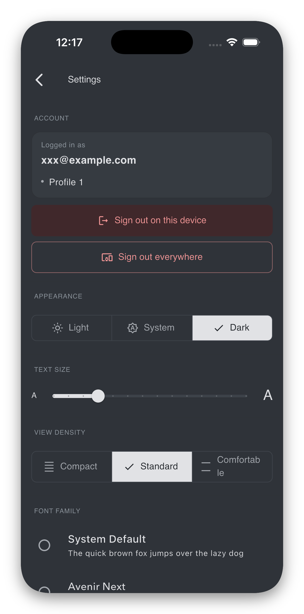
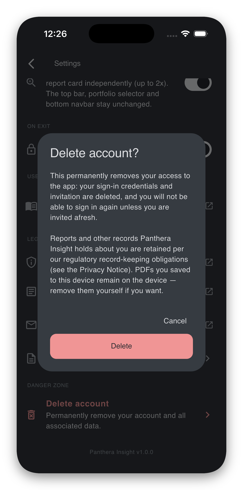
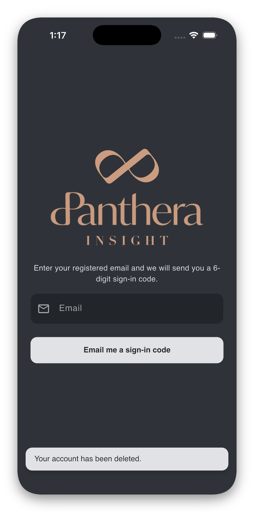

# Settings

The **Settings** screen is reached from the gear icon at the top of the report home. It collects everything that you can configure inside the app: account actions, appearance, accessibility, security, legal links, and account deletion.

This page lists the sections in the order they appear on screen.

{ width="260" }

## Update available *(only when relevant)*

If a newer version of Panthera Insight is in the App Store / Google Play, a gold banner appears at the top: **"Update available: X.Y.Z — Tap to open the store."** Tap it to be taken to the store listing. The banner disappears once you install the update.

## Account

Shows the email you are signed in as, the client account(s) you have access to, and two sign-out actions.

- **Logged in as** — the email Panthera has on file for you. If this looks wrong, contact your relationship manager; the address is not editable from inside the app.
- **Accessible profiles** — up to three are shown inline. If you have four or more, tap ***N*** **profiles** / **Hide profiles** to expand or collapse the list.

### Sign-out

- **Sign out on this device** *(red filled-background, red text)*. Clears your session on this device only. After confirming, you will be returned to the sign-in screen on this device; other devices keep their sessions. Use this when you simply want to step away from the app on this device.
- **Sign out everywhere** *(outlined, red)*. Ends your session on **every** device where you have signed in. Use this if you suspect unauthorised access, if you have lost a device, or if you want a clean slate.

Each option asks for confirmation before acting.

??? tip "If a sign-out fails"
    Sign-out almost always succeeds locally — the device's session is wiped even if the server call has trouble. If you see an error, check your internet connection and try again. To be safe, you can also use **Sign out everywhere** the next time you are online.

## Appearance

Three controls govern how the app looks:

| Control | What it does |
| ------- | ------------ |
| **Theme** | Segmented switch between *Light*, *System* (default), and *Dark*. *System* follows your device's system-wide setting. |
| **Text Size** | Slider from about 70% to 200% of the default. The change is live — you see it apply as you drag. |
| **View Density** | Segmented switch between *Compact*, *Standard*, and *Comfortable*, controlling vertical spacing. |
| **Font Family** | Radio list of available fonts. Each option previews the sentence *"The quick brown fox jumps over the lazy dog"* in that font. |

These settings are saved per device.

## Zoom Accessibility

A single switch: **Pinch-to-zoom report zones**. When on, you can pinch to enlarge the header data and chart card on the report home (independently, up to 2×). Turn off if you find yourself triggering it by accident. See [Viewing your reports → Zooming in](viewing-reports.md#zooming-in).

## On Exit — Keep me signed in

This is the same setting offered after your first sign-in. The switch controls what happens when you exit the app:

- **On** — your sign-in session stays cached. The next launch unlocks with your device's PIN, fingerprint, or face.
- **Off** — the session is wiped when you exit. The next launch requires a fresh email code.

Tap the small **i** info icon next to the title to see the same explanation as a dialog. The dialog also reminds you that **reports you have downloaded to this device are not affected** by this setting — they remain saved locally either way.

??? tip "If the switch is greyed out"
    Your device has no PIN / biometrics set, so the app cannot offer cached sign-in. Set up a screen lock in your device's system settings, then come back — the switch becomes available.

## User Guide

A single link, **Open user guide**, that brings you to this site. Use it if you ever need to revisit these instructions.

## Legal

- **Privacy policy** — opens the [Privacy Notice](https://panthera-sg.github.io/panthera-insight-legal/privacy.html) in your browser.
- **Terms of service** — opens the [Terms of Service](https://panthera-sg.github.io/panthera-insight-legal/terms.html).
- **Contact data protection officer** — composes an email to [it@pantherafo.com](mailto:it@pantherafo.com).
- **Open source licenses** — opens an in-app screen listing the open-source software bundled with Panthera Insight, with each package's licence text.

## Danger Zone — Delete account

The **Delete account** tile lets you remove your access to the app. The flow asks you to confirm deliberately:

1. Tap **Delete account**.
2. A dialog explains what will be removed (your access, your local data) and what Panthera must retain for regulatory reasons (the reports themselves and the records of who they were prepared for). To prevent accidental deletion, the **Delete** button stays disabled until you **type `DELETE`** in the box. If you would rather delete from a web browser, the dialog also links the [Delete your account](https://panthera-sg.github.io/panthera-insight-legal/delete-account.html) page. Read it and confirm.
3. The app calls Panthera's server-side deletion routine while you wait.
4. On success, the app signs you out, clears any cached data on the device, and shows the snackbar **"Your account has been deleted."**

{ width="220" } { width="220" }

!!! danger "Deletion is irreversible"
    Once your account is deleted, your email is removed from the access allow-list. You will not be able to sign in again unless Panthera invites you afresh as a new account holder.

??? tip "If deletion fails"
    The snackbar reads **"We could not delete your account just now. Please try again, or contact the data protection officer if this keeps happening."** Check your internet connection and try once more. If it keeps failing, email [it@pantherafo.com](mailto:it@pantherafo.com) and the DPO will action the deletion on the server side.

??? tip "What is retained after deletion"
    For regulatory reasons (Panthera is a MAS-licensed entity) the firm must keep certain client records — including portfolio reports prepared for you and the profile information against which they were prepared — for the periods set by applicable law. These records are not generated by you and remain in Panthera's books after your access is deleted. The [Delete your account](https://panthera-sg.github.io/panthera-insight-legal/delete-account.html) page describes this in detail.

??? tip "If you no longer have access to the app"
    If the email associated with your account is no longer reachable, you cannot sign in to trigger deletion from the app. The [Delete your account](https://panthera-sg.github.io/panthera-insight-legal/delete-account.html) page describes the email-based alternative.

## App version

At the bottom of the screen the app shows its current version, e.g. **"Panthera Insight v1.2.3"**. Useful to mention when contacting support.
