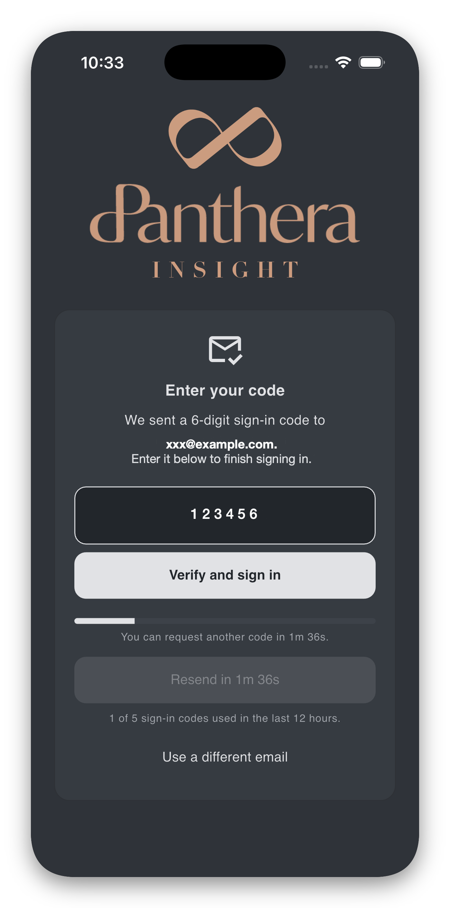
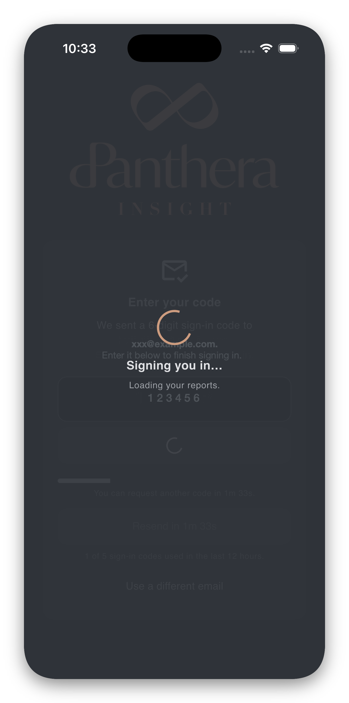
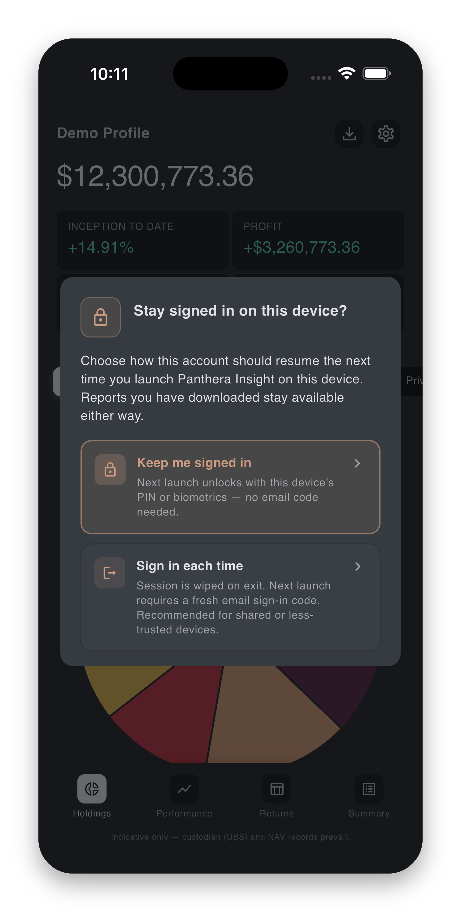
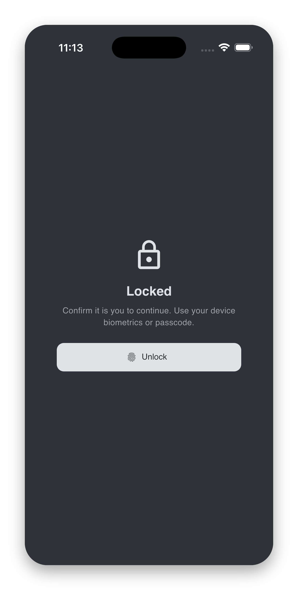
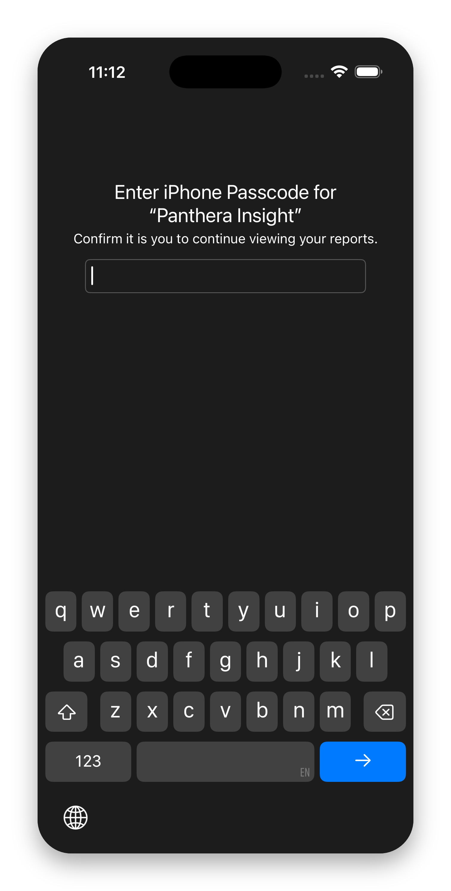
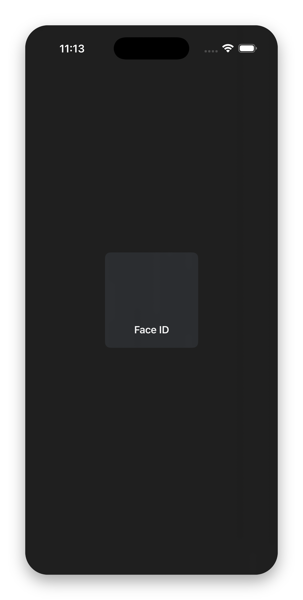

# Signing in

Panthera Insight has **no in-app password**. Every sign-in starts with a fresh **6-digit code emailed to you**. After the first successful sign-in you may choose to **keep the session cached** on the device — subsequent app launches then re-open with your **device's own unlock method** (fingerprint, face, or your device's PIN / passcode), without needing a new code each time.

In other words, the only two things you can be asked for are:

- A **sign-in code** from your inbox, and
- Your **device unlock** (same fingerprint / face / PIN you use to unlock the device itself).

!!! warning "Important Declaration"
    Panthera Insight and the team will **never request any pin and password** from you. You should **never disclose** any of these, **including the email verification code**, even if you're seeking assistance from our end.

## Signing in with an email code

1. Open the app. After the disclaimer, you arrive at the sign-in screen.
2. Enter your email address.
3. Tap **Email me a sign-in code**. The code arrives within a few seconds.
4. Enter the 6-digit code.
5. Tap **Verify and sign in**. A short "Signing you in… Loading your reports." overlay appears, then the report home loads.

{ width="220" } { width="220" } { width="220" }

??? tip "If the code does not arrive"
    Check your spam / junk folder first. If it still does not appear after about a minute, tap **Resend code**. A short cooldown (around two minutes) applies between resends — the button shows **Resend in M:SS** while it counts down, with a progress bar underneath. You can also tap **Use a different email** if you typed the wrong address.

??? tip "If the code is rejected"
    Codes expire after a short window and can only be used once. The most common cause is a typo or an old code from a previous email. Request a fresh one with **Resend code**.

??? tip "If you see "Try again in M:SS" under the Verify button"
    After repeated failed verification attempts the app puts a short cooldown (around five minutes) on the Verify button to protect your account. Wait for the countdown to finish; a fresh code may also be requested in the meantime.

??? warning "Too many attempts. You have used your daily sign-in codes…"
    For security, the app limits how many sign-in codes can be requested per day. If you hit the daily limit, a red banner appears and you will need to try again after 12 hours — or contact your relationship manager if you need access sooner.

## Keep me signed in

Immediately after your first successful sign-in, the app shows a dialog titled **"Stay signed in on this device?"** with two choices:

- **Keep me signed in** *(recommended)*. The next launch unlocks with this device's PIN, fingerprint, or face — no email code needed. The session remains cached on this device until you sign out or it expires.
- **Sign in each time**. The session is wiped when you exit the app. The next launch requires a fresh email code.

Pick whichever fits how you use the app. You can change your mind any time in **Settings → On Exit → Keep me signed in**.

{ width="260" }

??? tip "If your device has no PIN or biometrics set"
    The prompt is skipped automatically and the app shows: *"Sign-in caching is unavailable because this device has no PIN or biometrics set. You will be asked for an email code each launch."* Set up a screen lock in your device's system settings to enable the option.

## Re-opening the app — the lock screen

If you chose **Keep me signed in**, the app shows a **lock screen** when you:

- Re-open the app from cold, or
- Return to it after it has been in the background for a couple of minutes.

The screen shows a lock icon and **"Confirm it is you to continue. Use your device biometrics or passcode."** Tap **Unlock**, complete the device prompt, and the app opens silently to wherever you left off.

{ width="220" } { width="220" } { width="220" }

??? tip "If the unlock fails"
    After multiple failed unlock attempts the lock screen shows **"Too many failed attempts. Try again in M:SS."** Wait for the countdown to finish and try again. If the device unlock simply does not prompt, see [Troubleshooting](troubleshooting.md#lock-screen-issues).

??? tip "If your session has expired"
    Sessions expire after a long period of inactivity or after a security-sensitive change. When that happens the app returns to the sign-in screen and asks for a fresh email code, even if **Keep me signed in** is on. This is expected.

## Signing out

- **Sign out on this device** (Settings → Account) clears your session on this device only.
- **Sign out everywhere** (Settings → Account) ends the session on every device where you have signed in. Use this if you suspect unauthorised access, if you have lost a device, or if you just want a clean slate.

After signing out everywhere, the next sign-in starts fresh with a new email code.

See [Settings → Account](settings.md#account) for the exact buttons.

## If you still cannot sign in

Have a look at [Troubleshooting → Sign-in problems](troubleshooting.md#sign-in-problems). If nothing there helps, email [it@pantherafo.com](mailto:it@pantherafo.com).
