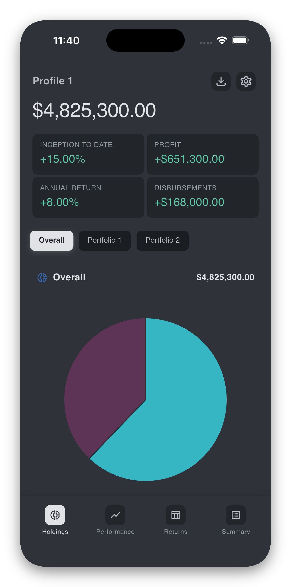
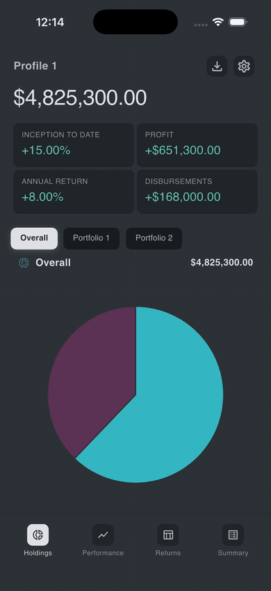
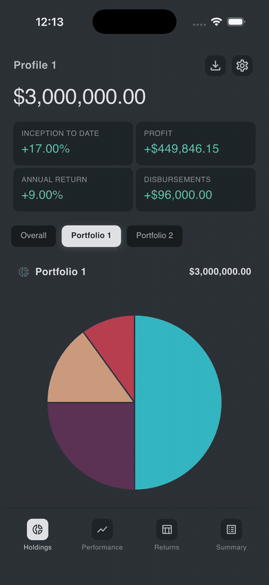
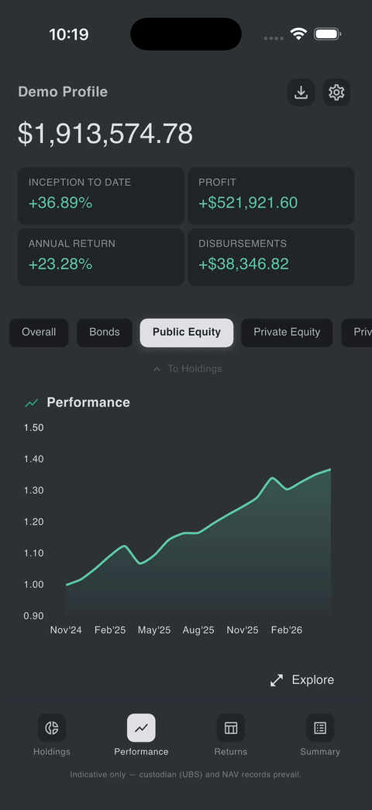
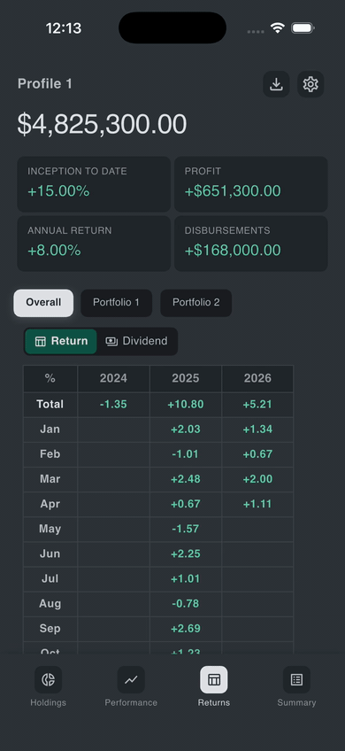
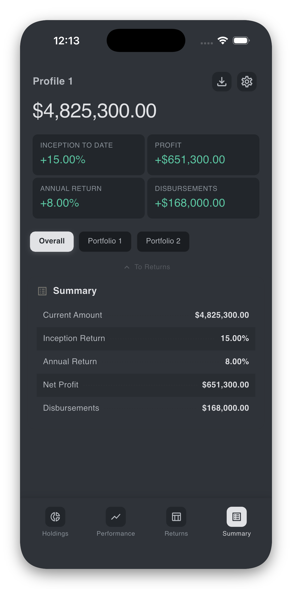

# Viewing your reports

Your monthly portfolio reports are prepared by Panthera Singapore's team and made available to you through the app. This page covers what you see on the report home, how to move between portfolios and chart types, and how to refresh.

For downloading reports as PDFs (including historical ones), see [Downloading reports](downloads.md).

## The report home

After signing in, the app opens on the **report home**. It is built around a single, scrollable card per report period, with three layers:

- **Header.** Client name, and a row of headline figures — ***Current Amount***, ***Inception Return***, ***Annual Return***, ***Net Profit***, ***Disbursements***.
- **Portfolio selector.** A horizontal chip strip listing the portfolios available under the current client.
- **Chart card.** The main visualisation for the selected portfolio and chart type, with a navbar across the bottom for switching views.

{ width="260" }

## Switching between accounts (clients)

If you have access to more than one client account, an **account selector** appears at the top of the home screen. Tap it to switch — all portfolios, figures, and charts then refresh to the newly selected client.

If you only have one client account, the selector is shown as a label and there is nothing to switch.

## Switching between portfolios

Each client may have several portfolios. There are two ways to move between them:

- Tap a chip in the **portfolio selector** strip.
- **Swipe left or right** on the chart card. The carousel wraps around — swiping past the last portfolio takes you back to the first.

{ width="260" }

## Switching between chart types

The chart card supports five views:

| View | Shows |
| ---- | ----- |
| **Holdings** | Allocation pie of the portfolio. |
| **Performance** | Line chart of valuation over time. |
| **Returns** | Returns table. If a dividend table exists for the period, it is shown alongside. |
| **Dividend** | Dividend table (where applicable). |
| **Summary** | Key metrics table for the period. |

To move between views:

- Tap a label in the **navbar** at the bottom of the chart card, or
- **Swipe up or down** on the chart. A small hint label (**To Holdings**, **To Performance**, …) appears mid-swipe so you know where you are going.

{ width="260" }

## Refreshing

To pull the latest data from Panthera's servers:

- **Pull down** on the header. A custom spinner appears as you drag. Release once the spinner is fully drawn — the report data reloads.

You can also reach the report home from anywhere by closing the Settings or Downloads screen.

## Zooming in

If **Pinch-to-zoom report zones** is on in [Settings → Zoom Accessibility](settings.md#zoom-accessibility), you can:

- **Pinch** on the **header** to magnify the headline figures, and
- **Pinch** on the **chart card** to magnify the chart, independently.

Zoom is limited to 2× and resets when you leave the screen.

## What's inside a report

A typical report covers:

- A **Brief Summary** in the header which updates according to the selected portfolio.
- **Holdings** broken down by asset class.

{ width="260" }

- **Historical performance** charts.

{ width="260" }

- **Returns** and, where applicable, **dividend** breakdowns.

{ width="260" }

- A **summary** of valuations and performance for the period.

{ width="260" }

## Edge cases and tips

??? tip "If the report does not load — "Failed to load profile" / "Failed to load reports""
    The app shows a friendly error message and a **Retry** button. Check that you have a working internet connection, then tap **Retry**. If the error persists, sign out and back in. If it still persists, please email [it@pantherafo.com](mailto:it@pantherafo.com).

??? tip "If you see "No reports available yet" / "No *** data""
    Your account is set up correctly, but no report or specific chart data has been finalised yet for the current period. Please check with your Panthera relationship manager that the period's report is ready on their side.

??? tip "If a silver banner appears at the top — "Update available""
    A newer version of the app is in the App Store / Google Play. Tap the banner to be taken to the store. The current version continues to work; updating is recommended for security and bug fixes. The same banner is shown in **Settings** until you update.

??? warning "If the numbers look wrong"
    Reports are prepared with reasonable care but may contain pricing or timing differences relative to the underlying custodian records. **In case of a discrepancy, the custodian records prevail.** Please reach out to your Panthera relationship manager so they can review and, if needed, correct the report. Do not act on the in-app figures alone.

